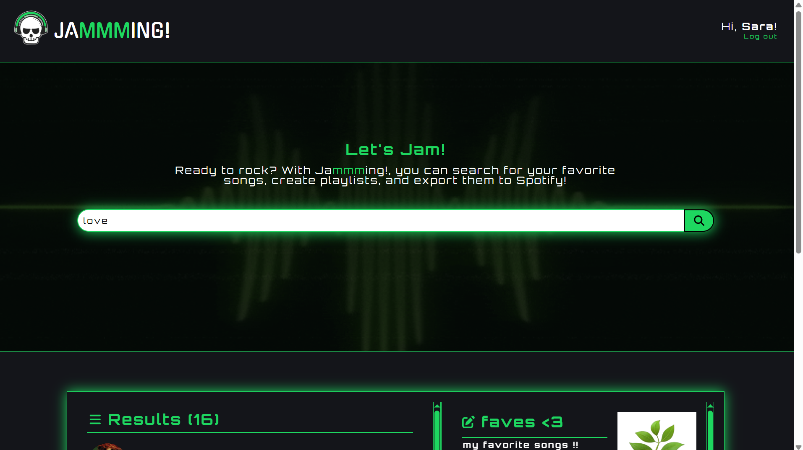
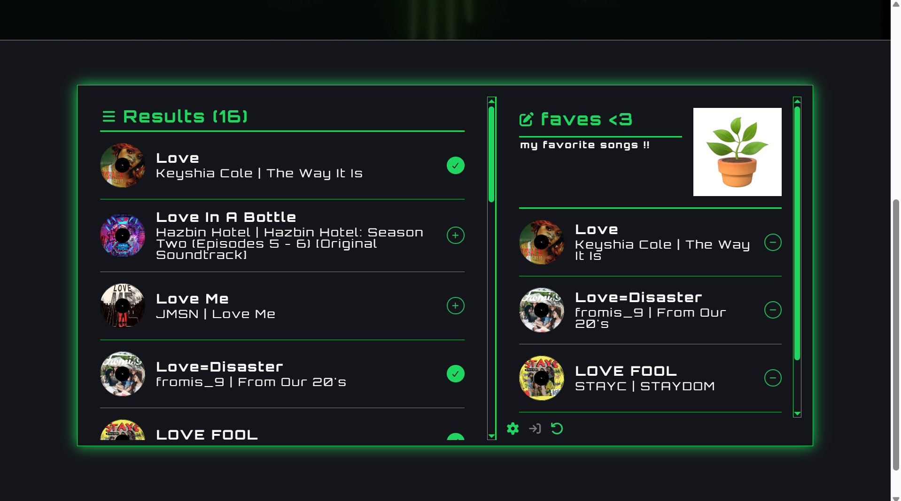
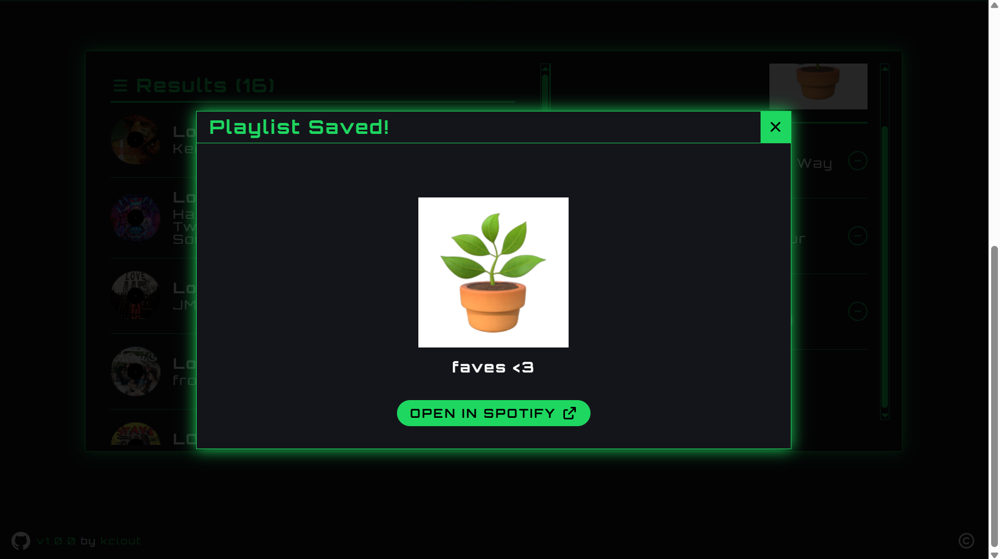
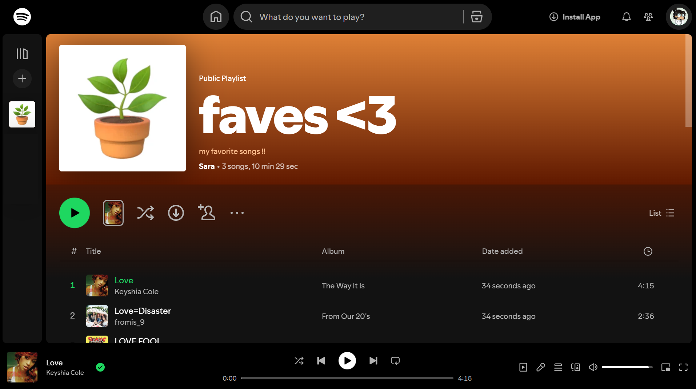

# Jammming! :musical_note:

Ready to rock? With Jammming!, you can search for your favorite songs, create playlists, and export them to [Spotify](https://open.spotify.com/)!

This project was created to demonstrate understanding of React and its many features, including use of hooks and components. This project also demonstrates integration of APIs. Users are able to look up Spotify tracks by name, artist, or album, add tracks to a playlist, customize the playlist name, description, and cover, and export the playlist to their connected Spotify account.

[View the web app here!](https://kclout-jammming.netlify.app/)

**v1.0.0 UPDATE 11/19/2025:**
- Spotify integration is now functional!
- Added custom user greetings
- Playlists can now be reset either manually or after saving.
- Loading screens for awkward transitions during searching, saving playlists, etc.
- Future Updates:
    - Import and update already user's playlists from Spotify, saving playlist as a copy, etc.
    - Preview playback. Currently, Spotify API no longer supports previews. If I can find another solution, the feature will be implemented.
    - Set playlists to public/private. All playlists are currently created as public playlists. Spotify API has not updated to properly change the value through web apps at this time.

**v0.2.0 UPDATE 10/9/2025:**
- Added changes for accessibility
- Now shows number of tracks in Search Results and Playlist
- New layout for desktop
- Added minor code organization changes

## :notes: Features
- Choose songs from the entire Spotify library
- Search by name, artist, or album
- Customize playlist name, description, and photo cover
- Export custom playlists to Spotify

## :notes: How to Use

### :sparkles: For Users

#### :cd: Requirements
- Spotify account

#### :cd: Instructions
1. Log in to Spotify through Jammming!.
2. Use the search bar to find tracks, which will show up under "Results".
3. Add as many tracks as you want from Results to your playlist.
4. Customize the playlist name, description, and cover (description and cover are optional).
5. When ready to export, click "Save".

### :sparkles: For Developers

#### :cd: Requirements
- [Node](https://nodejs.org/en/download/) (npm)
- [React + Vite](https://vite.dev/guide/)
- [Font Awesome](https://docs.fontawesome.com/web/use-with/react) Icon Packages
- [React Image File Resizer](https://www.npmjs.com/package/react-image-file-resizer/v/0.3.0-beta.1)
- [React Tooltip](https://www.npmjs.com/package/react-tooltip)

#### :cd: Instructions
1. Download [Jammming-main.zip](https://github.com/kclout/Jammming/archive/refs/heads/main.zip) and extract all files to the `Jammming-main` folder.
2. Navigate to the app by entering `cd YOUR_FILE_PATH/Jammming-main` in the terminal of your code editor.
3. To start the app, enter `npm run dev`.

## :notes: Acknowledgements
This project was based off of [Sypher12233](https://github.com/Sypher12233)'s guide for the Jammming project on Codecademy, which can be found [here](https://github.com/Sypher12233/CC_jammming?tab=readme-ov-file#jammming-guides). The video tutorial and step-by-step guide really helped me understand the fundamentals of this project, so I would like to extend my thanks!

I also would like to shout out [marcelczubak](https://github.com/marcelczubak)'s web app [TuneFetch](https://github.com/marcelczubak/tune-fetch/tree/main), as it inspired the layout change in v0.2.0.

## :framed_picture: Gallery

